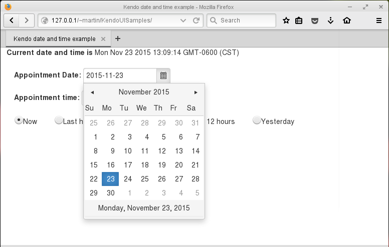
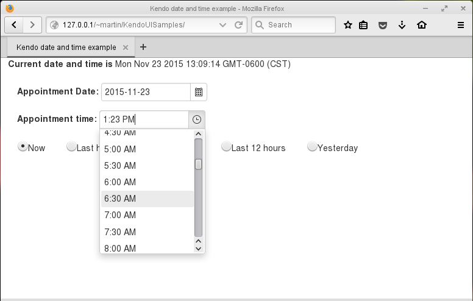
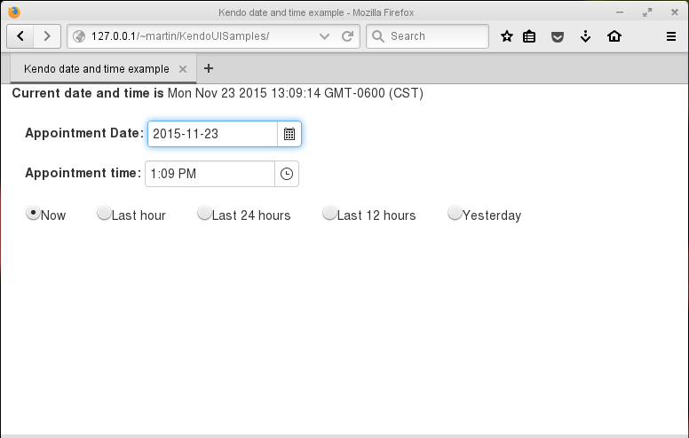
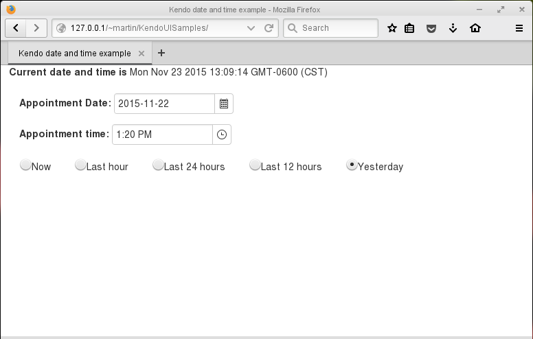
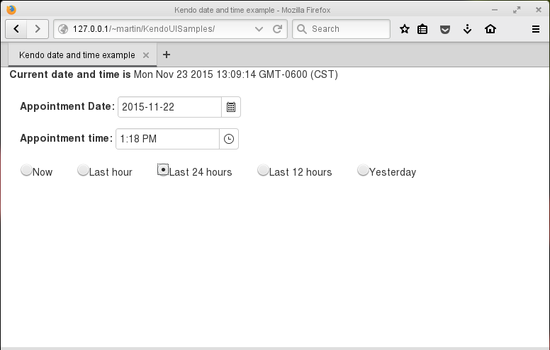

# Utilizando los controles Kendo UI DatePicker y TimePicker
		

Otro par de controles muy útiles incluidos en la suite de controles Kendo UI,  son los controles Kendo UI DatePicker y TimePicker con estos controles se logra que las interfaces web tengan una apariencia intuitiva y muy profesional  como si se tratase de una aplicación de escritorio (Desktop).

	

	<h2>Kendo UI DatePicker</h2>
	Este control proporciona una manera muy intuitiva para la selección de una fecha, tiene un campo de texto en donde puedes teclear la fecha deseada o bien seleccionarla de un calendario dropdown que aparece al momento de activar el control, como muestro en la siguiente imagen.
	

	

 

  <h2>Kendo UI DateTimePicker</h2>
  Este control es similar al DateTimePicker, permite teclear horas y segundos o bien seleccionarlo de una lista de las horas del día, como muestro en la siguiente imagen.

 

			  Ahora como ejemplo del uso de estos controles  pondré el código de un formulario que tiene un control DatePicker, un DateTimePicker y unos radiobuttons que configuran la fecha y la hora de los controles según la opción seleccionada. 
		La configuración de este ejemplo es igual a la configuración utilizada para el ejemplo de este <a href="http://xomalli.blogspot.mx/2015/10/utilizando-el-kendo-ui-grid-de-telerik.html">post.</a>.

Al ejecutarlo en el navegador lo veremos como en la siguiente imagen

 

Observamos como los controles <b>datePicker</b> y <b>dateTimePicker</b> cambian sus valores según la opción seleccionada en los radiobuttons. En la imagen al seleccionar la opción <i>“yesterday”</i>

 

Al seleccionar la opción <i>“Last 24 hours”</i> vemos el resultado en la siguiente imagen

 

  Enlaces relacionados:
  <ul>
<li><a href="http://demos.telerik.com/kendo-ui/datepicker/index">http://demos.telerik.com/kendo-ui/datepicker/index</a></li>
<li><a href="http://docs.telerik.com/kendo-ui/api/javascript/ui/datepicker">http://docs.telerik.com/kendo-ui/api/javascript/ui/datepicker</a></li>
<li><a href="http://docs.telerik.com/kendo-ui/api/javascript/ui/datetimepicker">http://docs.telerik.com/kendo-ui/api/javascript/ui/datetimepicker</a></li>
<li><a href="http://demos.telerik.com/kendo-ui/datetimepicker/index">http://demos.telerik.com/kendo-ui/datetimepicker/index</a></li>
  </ul>

